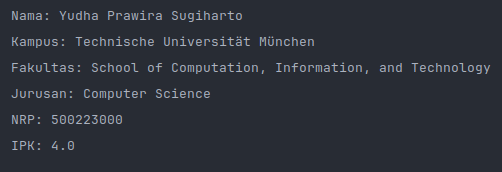
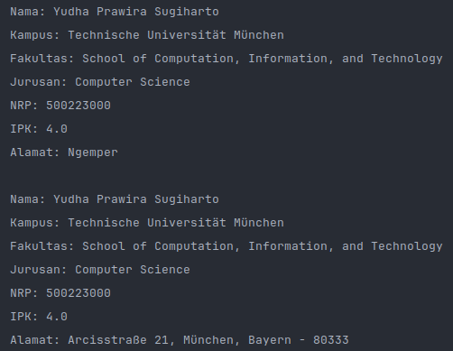

## 💡 Petunjuk Umum

- Kerjakan menggunakan bahasa pemrograman Java
- Tambahkan komentar untuk menjelaskan program
- Tulislah kode dengan rapi
- Program harus memenuhi Kriteria Penyelesaian
- Jika pakai AI (ChatGPT, Deepseek, dll), nilai 0

## 📘 Istilah Umum

- **Class:** adalah cetakan / template dari suatu object
- **Object:** adalah class yang sudah dibuat
- **Attribute:** adalah nilai yang disimpan di dalam class
- **Contructor:** adalah method yang bertanggung jawab untuk membuat object. Method ini akan dijalankan paling pertama saat membuat object

## Soal 1

### Perintah

Buatlah class `Mahasiswa` sehingga dapat dipanggil seperti contoh dibawah:

```java
class Main {
    public static void main(String[] args) {
        Mahasiswa mahasiswa = new Mahasiswa()
        .setNama("Yudha Prawira Sugiharto")
        .setKampus("Technische Universität München")
        .setFakultas("School of Computation, Information, and Technology")
        .setJurusan("Computer Science")
        .setNrp(500_223_000)
        .setIpk(4.0f);

        mahasiswa.info();
    }
}
```

### Contoh Output



### Kriteria Penyelesaian

1. Program harus mempuyai 2 class, yaitu `Main` dan `Mahasiswa`
2. Class `Mahasiswa` harus bisa dipanggil didalam `Main`
3. Main method hanya ada pada class `Main`
4. Program dapat dipanggil sesuai dengan contoh
5. Method `info()` akan menghasilkan output seperti pada contoh
6. Boleh menambahkan Method bantuan

## Soal 2

### Perintah

Pada soal 1, `attribute` bisa bernilai `null` jika tidak diisi. Dengan menggunakan jawaban soal 1, buatlah agar `attribute` tidak bisa bernilai `null`. Bisa dengan melempar `exception` atau dengan memberi `default value`.

### Keriteria Penyelesaian

1. Program diambil dari jawaban Soal 1
2. Semua attribute tidak bisa bernilai `null`
3. Khusus NRP, buatlah agar digitnya minimal 9
4. Boleh menambahkan method bantuan

## Soal 3

### Perintah

Menggunakan Jawaban soal 2, tambahkan class `Alamat` agar bisa dipanggil seperti contoh dibawah:

```java
class Main {
    public static void main(String[] args) {
        Mahasiswa mahasiswa = new Mahasiswa()
        .setNama("Yudha Prawira Sugiharto")
        .setKampus("Technische Universität München")
        .setFakultas("School of Computation, Information, and Technology")
        .setJurusan("Computer Science")
        .setNrp(500_223_000)
        .setIpk(4.0f);

        mahasiswa.info();

        Alamat alamat = new Alamat(
                "Arcisstraße 21",
                "München",
                "Bayern",
                "80333"
        );

        mahasiswa.setAlamat(alamat);

        mahasiswa.info();
    }
}
```

### Contoh Output



### Kriteria Penyelesaian

1. Program diambil dari jawaban Soal 2
2. Program memiliki 3 classs, yaitu `Mahasiswa`, `Main`, `Alamat`
3. Class `Alamat` memiliki 4 attribute, yaitu `jalan`, `kota`, `provinsi`, dan `kode pos`
4. Class `Alamat` memiliki constructor berparameter
5. Alamat tidak boleh kosong, jika kosong, lempar `exception` atau berikan `default value`
6. Boleh menambahkan method bantuan

## 🗓️ Deadline

- Tugas ini harus dikumpulkan **paling lambat** pada:

  📅 **Hari/Tanggal**: Kamis, 15 Mei 2025
  ⏰ **Pukul**: 18:00 WIB

- Pengumpulan dilakukan melalui MyITS Classroom

⛔ **Catatan**: Tugas yang terlambat, hanya dapat nilai maksimal 50 saja
