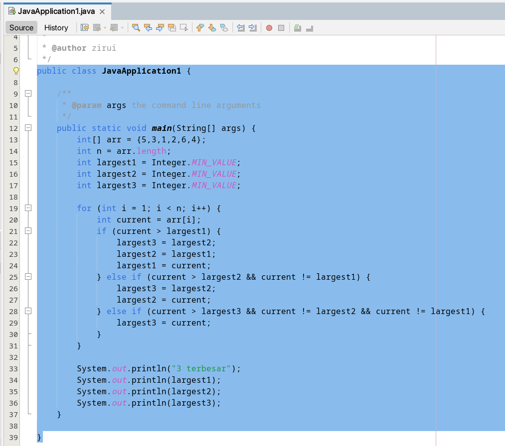
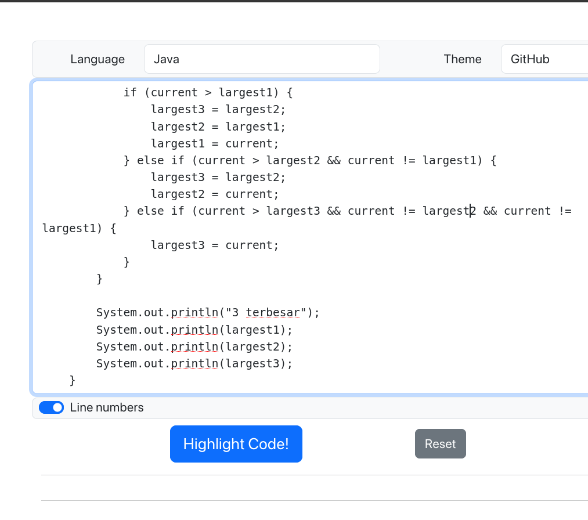
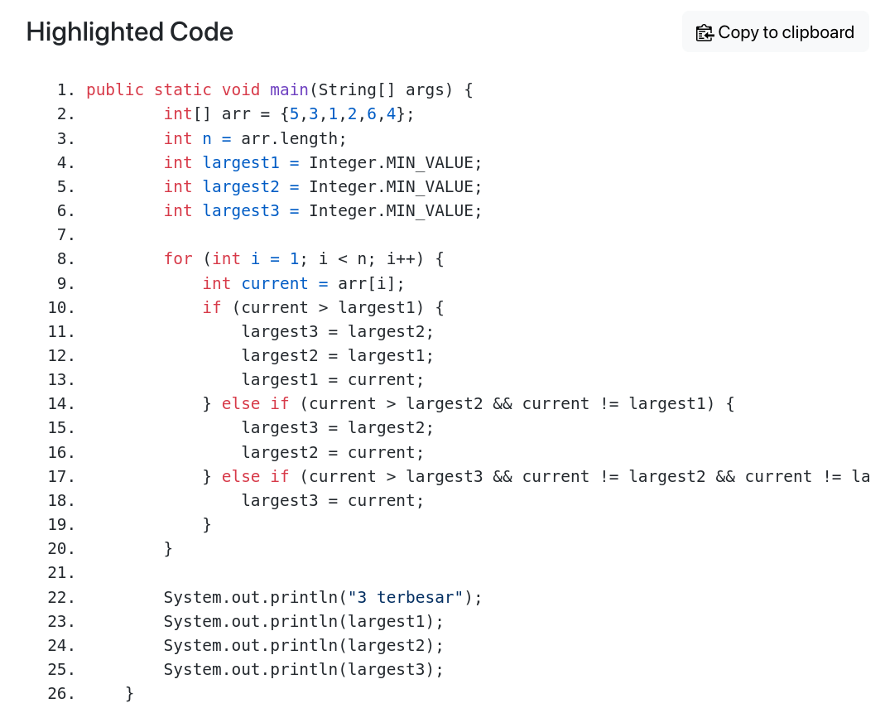
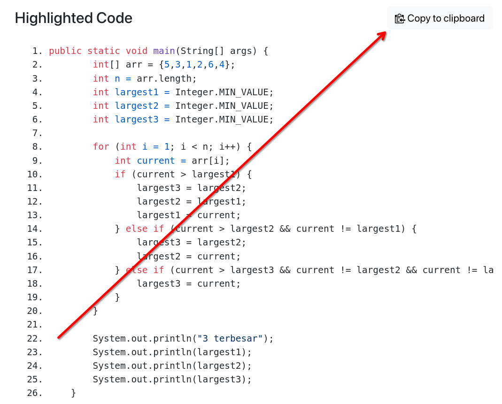
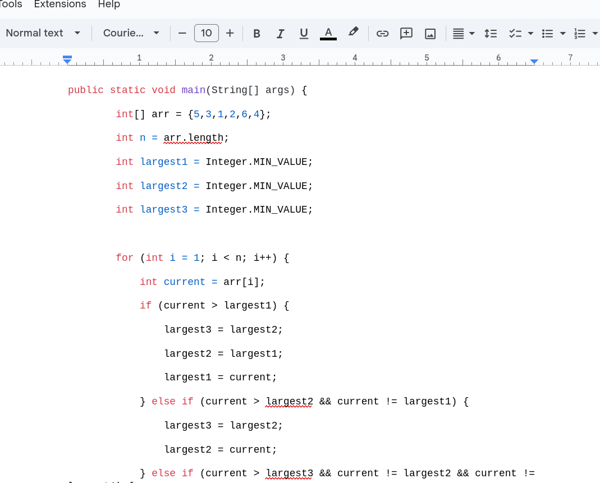
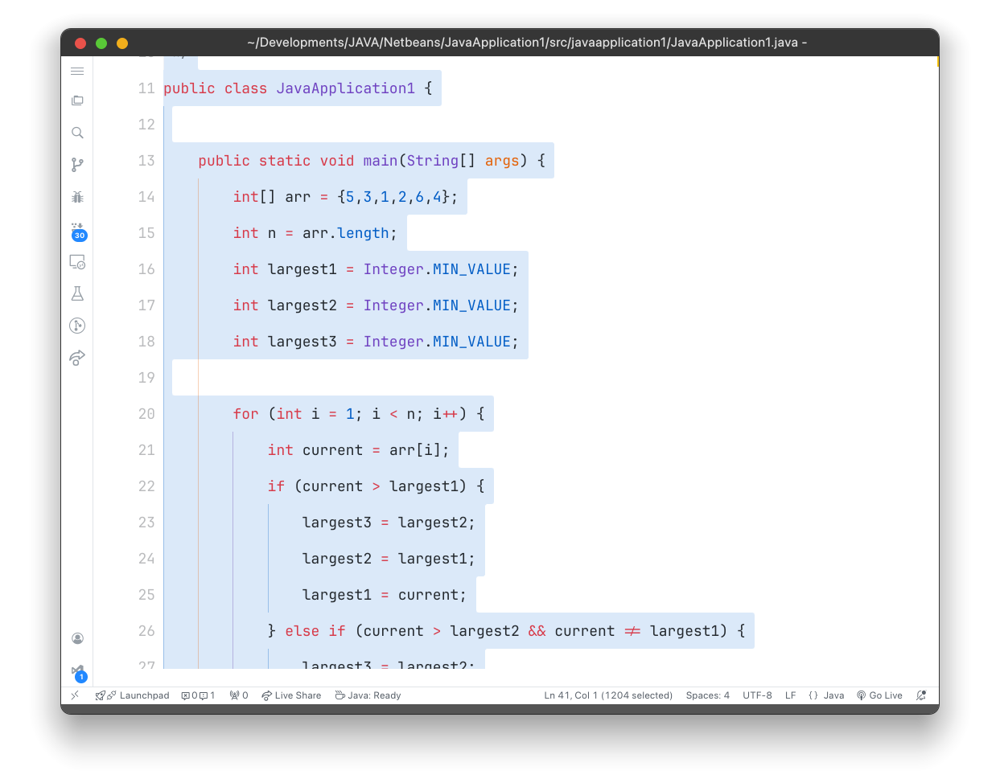
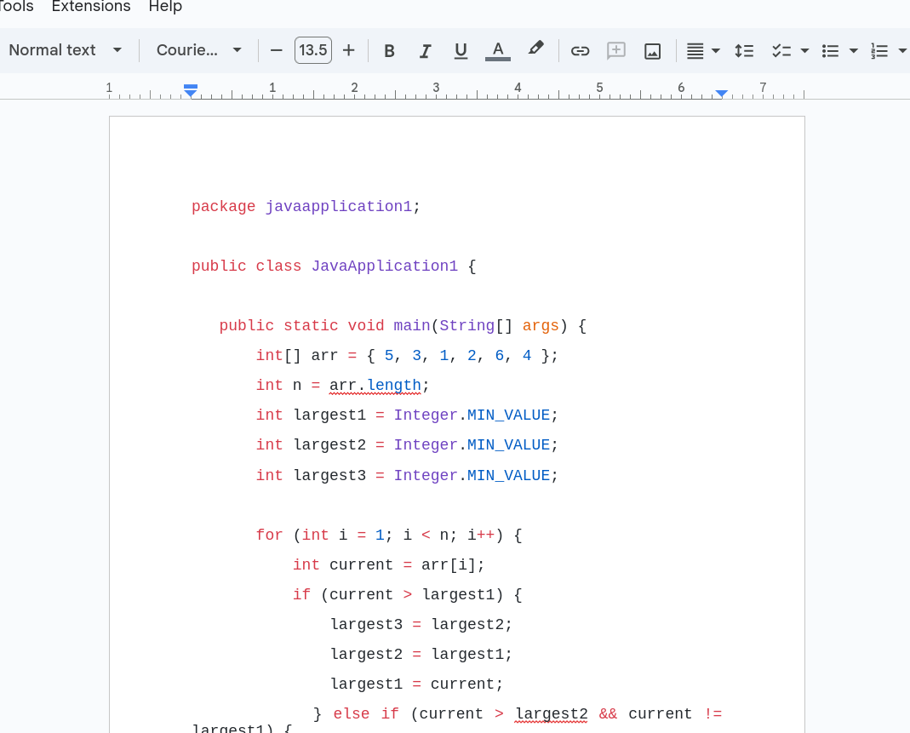
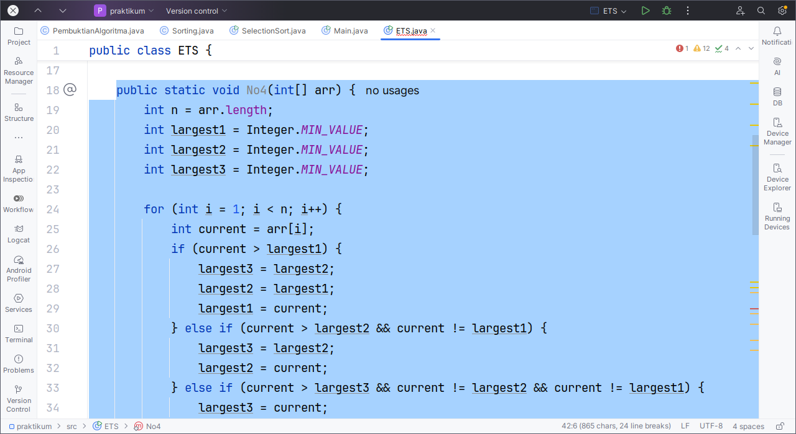
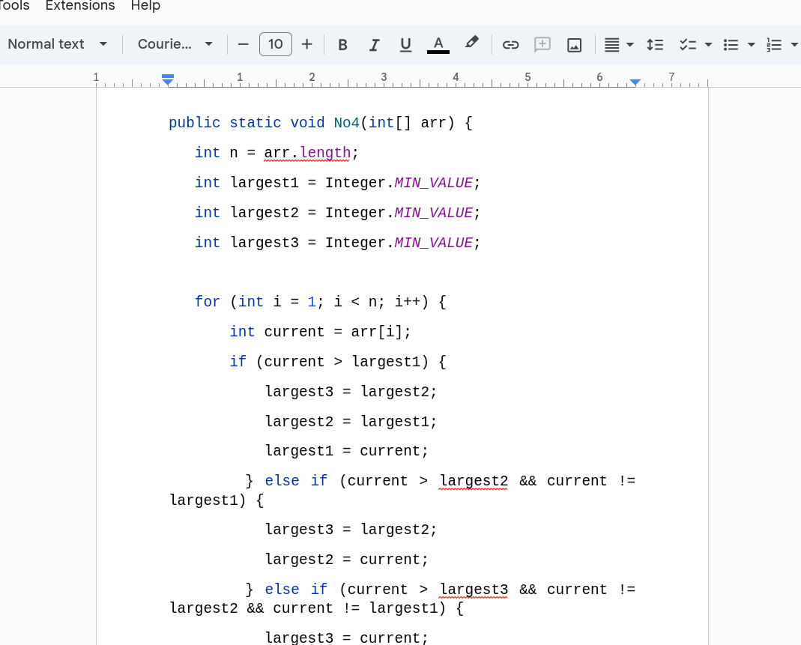

## 📝 Persiapan

- Alat Ngoding (Netbeans, VS Code, Intellij IDEA)
- Google Docs / MS Word

## Netbeans

Jika kamu pakai Netbeans, maka bisa mengikuti cara berikut

### Menyalin Kode dari NetBeans

1. Buka Netbeans, lalu copy kode yang diinginkan

2. Buka [website ini](https://highlight.hohli.com/?language=java&theme=github&numbers=), kemudian paste kode tadi ke web tersebut

3. Klik tombol **Highlight Code**

4. Nanti dibawah akan muncul kode yang sudah diformat

5. Lalu klik **Copy to clipboard**

6. Buka Google Docs atau Word lalu **paste** atau <kbd>CTRL</kbd> + <kbd>V</kbd>

Sekarang kode kamu dari Netbeans sudah rapi

## VSCode

VSCode bisa langsung copy kode dengan rapi tanpa alat bantuan

### ⚠️ Perhatikan

Format warna & text akan mengikuti settingan dari VSCode, jadi perhatikan tema & settingan yang digunakan

### Menyalin Kode dari VSCode

1. Buka VSCode, copy kode yang diinginkan

2. Langsung paste ke Google Docs atau Word

## Intellij IDEA

Intellij IDEA juga bisa copy kode dengan rapi tanpa alat bantuan

### ⚠️ Perhatikan

Format warna akan mengikuti dari settingan Intellij IDEA

### Menyalin Kode dari Intellij IDEA

1. Buka Intellij IDEA, copy kode yang diinginkan

2. Langsung paste ke Google Docs atau Word
